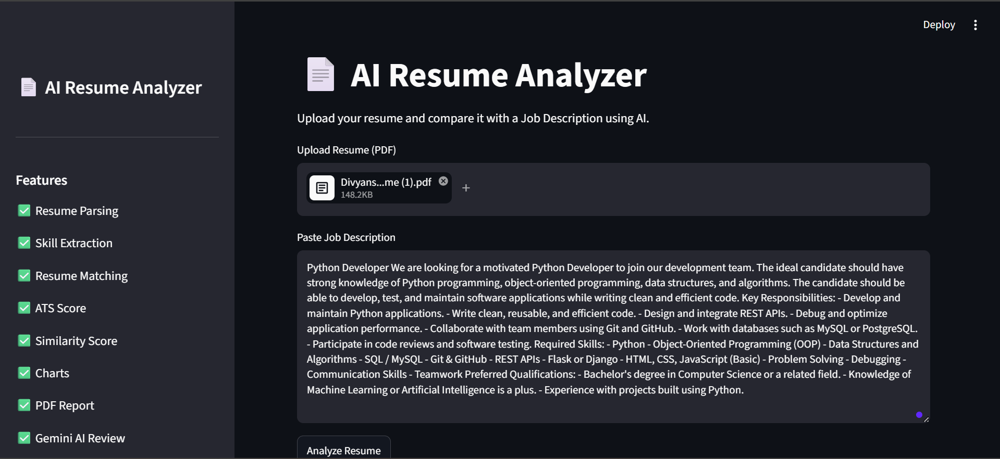
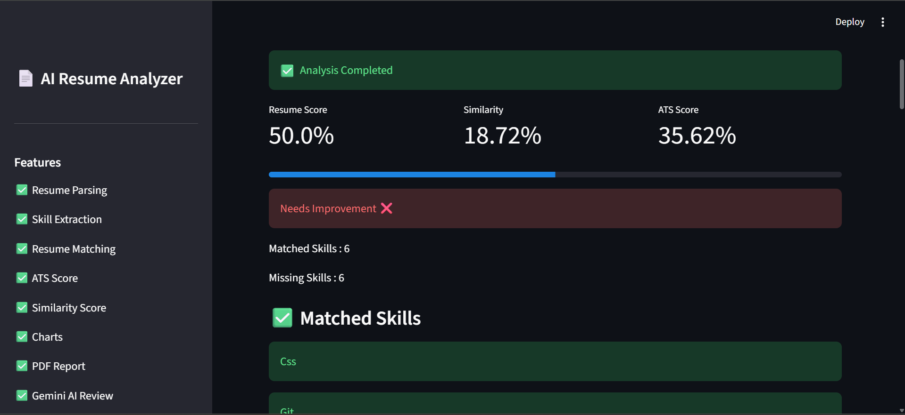
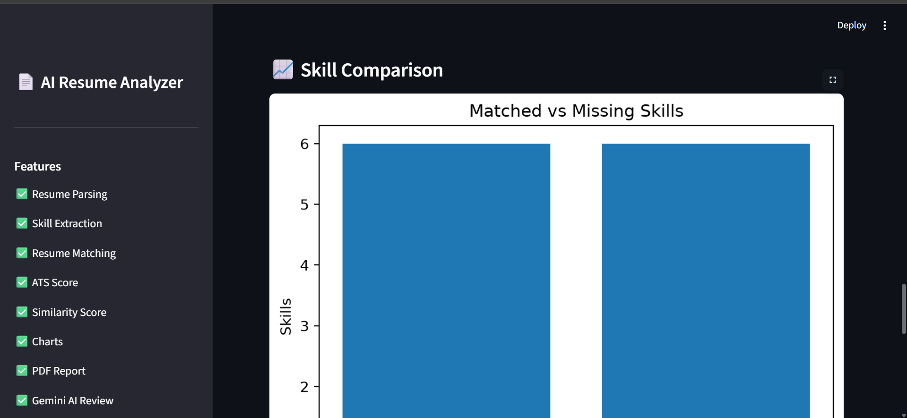
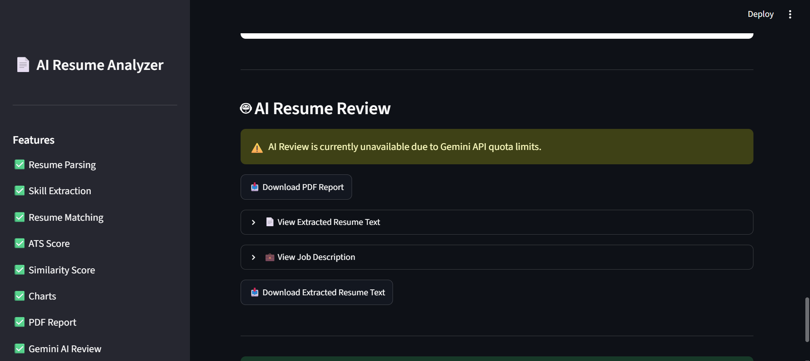

# 📄 AI Resume Analyzer

An AI-powered Resume Analyzer built using **Python**, **Streamlit**, and **Google Gemini AI**. This application analyzes a resume against a job description, calculates ATS compatibility, extracts skills, measures similarity, and provides AI-generated feedback to help candidates improve their resumes.

---

## 🚀 Features

- 📄 Upload Resume in PDF format
- 🔍 Automatic Resume Text Extraction
- 🧠 Skill Extraction from Resume & Job Description
- ✅ Matched Skills Detection
- ❌ Missing Skills Identification
- 📊 Resume Matching Score
- 🎯 ATS Score Calculation
- 📈 Similarity Score using NLP
- 📉 Skill Analysis Pie Chart
- 📊 Skill Comparison Bar Chart
- 🤖 AI Resume Review using Google Gemini
- 💡 Resume Improvement Suggestions
- 📥 Download Detailed PDF Report
- 📄 Download Extracted Resume Text
- 💼 View Parsed Resume and Job Description

---

## 🛠️ Tech Stack

| Technology | Purpose |
|------------|---------|
| Python | Backend Logic |
| Streamlit | User Interface |
| Pandas | Data Processing |
| pdfplumber | PDF Text Extraction |
| Scikit-learn | Cosine Similarity |
| Matplotlib | Charts & Visualization |
| ReportLab | PDF Report Generation |
| Google Gemini API | AI Resume Review |
| dotenv | Environment Variables |

---

## 📂 Project Structure

```text
AI-Resume-Analyzer/
│
├── app.py
├── requirements.txt
├── README.md
├── .gitignore
├── .env
│
├── data/
│   ├── skills.csv
│   └── resumes/
│
├── reports/
│
├── src/
│   ├── analyzer.py
│   ├── ats_score.py
│   ├── charts.py
│   ├── gemini_analyzer.py
│   ├── report_generator.py
│   ├── resume_parser.py
│   ├── similarity.py
│   ├── skill_extractor.py
│   └── suggestions.py
│
└── screenshots/
```

---

## ⚙️ Installation

### Clone the Repository

```bash
git clone https://github.com/DivyanshSahu678/AI-Resume-Analyzer.git
```

```bash
cd AI-Resume-Analyzer
```

---

### Create Virtual Environment

```bash
python -m venv venv
```

### Activate Virtual Environment

#### Windows

```bash
venv\Scripts\activate
```

#### Linux / macOS

```bash
source venv/bin/activate
```

---

### Install Dependencies

```bash
pip install -r requirements.txt
```

---

### Add Gemini API Key

Create a **.env** file in the project root.

```env
GOOGLE_API_KEY=YOUR_API_KEY
```

---

### Run the Project

```bash
streamlit run app.py
```

---

## 📊 Workflow

```text
Upload Resume (PDF)
          │
          ▼
Resume Text Extraction
          │
          ▼
Skill Extraction
          │
          ▼
Resume vs Job Description Analysis
          │
          ▼
ATS Score + Similarity Score
          │
          ▼
Charts & Visualizations
          │
          ▼
Gemini AI Feedback
          │
          ▼
Generate PDF Report
```

---

## 📸 Screenshots

### Home Page



---

### Resume Analysis



---

### ATS Score

> Add screenshot here

---

### Charts



---

### AI Resume Review



---

### PDF Report

> Add screenshot here

---

## 📈 Future Improvements

- Multiple Resume Comparison
- Resume Ranking
- Cover Letter Generator
- AI Interview Questions
- Resume History
- Cloud Deployment
- Authentication System
- Dark Mode

---

## 🎯 Learning Outcomes

Through this project, I learned:

- Python Project Structure
- Streamlit Development
- PDF Parsing
- Natural Language Processing Basics
- Cosine Similarity
- ATS Resume Analysis
- Data Visualization
- API Integration
- Environment Variable Management
- Modular Programming

---

## 🤝 Contributing

Contributions, suggestions, and improvements are welcome.

1. Fork the repository
2. Create a new branch
3. Commit your changes
4. Push to your branch
5. Open a Pull Request

---

## 📜 License

This project is licensed under the MIT License.

---

## 👨‍💻 Author

### Divyansh Sahu

**B.Tech Computer Science Engineering**

🔗 GitHub: https://github.com/DivyanshSahu678

🔗 LinkedIn: www.linkedin.com/in/divyansh-sahu-34a026345

---

## ⭐ Support

If you found this project helpful:

⭐ Star this repository

🍴 Fork it

📢 Share it with others

---

### Thank you for visiting this repository! 🚀